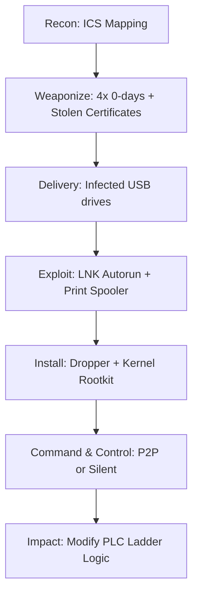

## Summary  
What if a USB stick could delay a nuclear program?

This post is a comprehensive deep-dive into **Stuxnet** — the first publicly known digital weapon engineered to sabotage physical systems.  
Written by an Israeli researcher, it covers reverse engineering, ICS/SCADA internals, attack logic, and the geopolitical ripple effects.  
Everything here is based on open-source intelligence, technical analysis, and code disassembly.

This isn't an article. It's a postmortem of the most sophisticated cyber-physical operation ever executed.

---

## Executive Summary  
**Stuxnet** was a state-sponsored, modular computer worm designed to target industrial systems. Its mission: silently sabotage the IR-1 uranium enrichment centrifuges in **Natanz, Iran**.

Discovered in 2010, Stuxnet had been active since at least 2007–2008, operating inside air-gapped environments and manipulating **Siemens S7-300/400 PLCs** to degrade equipment without raising alarms.

It used four zero-day vulnerabilities, stolen digital certificates, and kernel-level rootkits to remain undetected for months. The worm is widely attributed to a joint **U.S.-Israeli operation (code name: Olympic Games).**

---
## Zero-Day Exploits Used by Stuxnet

The operational effectiveness of Stuxnet heavily relied on multiple **previously unknown vulnerabilities** (zero-days), which enabled both stealth and privilege escalation across systems.

```markdown
| CVE ID          | Component           | Description                                        | Purpose                         |
|-----------------|---------------------|----------------------------------------------------|----------------------------------|
| CVE-2010-2568   | Windows Shell        | `.LNK` icon handler allowed USB code execution     | Initial infection vector         |
| CVE-2010-2729   | Windows Win32k.sys   | Keyboard layout vulnerability enabled escalation   | Local privilege escalation       |
| CVE-2010-2743   | Windows Task Scheduler | Weak permissions on `.JOB` tasks                  | Persistence / UAC bypass         |
| CVE-2010-2772   | Siemens Step7        | Hardcoded passwords + RPC flaws in engineering SW  | PLC access and manipulation      |
```

 **Note:** All four zero-days were active **prior to public disclosure**.  
Stuxnet operated silently in air-gapped environments for **over a year**, exploiting trust in ICS software and Windows internals — with surgical precision.

## Strategic Background  
**Target:** Iran’s nuclear enrichment facility in Natanz.  
**Problem:** Air-gapped, isolated, and secured.  
**Objective:** Delay Iran’s enrichment program without triggering open war.  
**Method:** Exploit trust in industrial systems. Attack via logic, not explosives.

  
*This image was recreated using Sora and is inspired by publicly available content on Wikipedia (licensed under CC BY-SA 3.0).*

---

## Full Kill Chain  


---

## Dropper: Exploit via LNK (CVE-2010-2568)  
The initial infection vector used a Windows `.LNK` shortcut file that exploited a flaw in how icons were processed. The target didn’t need to click anything — just viewing the USB in Windows Explorer triggered code execution.

This exploit leveraged CVE-2010-2568, bypassed user interaction, and installed a loader on the system.

---

## Loader Behavior  
The loader deployed a temporary executable, typically named like `~WTR4132.tmp`, which injected a payload into memory using classic techniques:

```asm
push 0x40        ; PAGE_EXECUTE_READWRITE
push 0x1000      ; MEM_COMMIT
push edx         ; size
push 0           ; lpAddress
call VirtualAlloc
mov edi, eax     ; save memory address
...
call CreateRemoteThread
```

---

## Kernel-Level Rootkit: MRxNet.sys  
This rootkit disguised itself as a Microsoft redirector driver and was signed with a stolen Realtek digital certificate.

- Hooks `ZwQueryDirectoryFile` and `ZwQuerySystemInformation` to hide files and processes  
- Prevents detection of Stuxnet-related binaries  
- Loads on boot via:
```
HKLM\SYSTEM\CurrentControlSet\Services\MRxNet
```

```asm
mov eax, [esp+4]
cmp [eax+FileName], "~WTR"
je skip_entry
call OriginalZwQueryDirectoryFile
```

---

## Target Environment Fingerprinting  
Before taking any action, Stuxnet performed **deep fingerprinting**:

- Checked for Siemens Step7 software  
- Validated presence of **S7-315 or S7-417 PLCs**  
- Inspected DB120, DB121, OB1, OB35  

If no match — it self-deleted silently.

---

## PLC Injection: Siemens S7 Ladder Logic  
Objectives:

1. Spin centrifuges up/down repeatedly (1410 → 2 → 1064 RPM)  
2. Spoof sensors to hide real values  
3. Cause long-term physical degradation  

  
*Image source: Wikimedia Commons / Author: Zubro / License: CC BY-SA 3.0

---

## Sample STL Code  
```stl
L     DB121.DBW16       // Load current speed  
T     MW100             // Move to memory word  
L     1410  
T     DB121.DBW16       // Force rotor to spin up  
```

---

## Step7 & S7COMM  
Used hijacked libraries:

- `S7COMM.dll`  
- `s7otbxdx.dll`  
  
*Image source: Wikimedia Commons / Author: Zubro / License: CC BY-SA 3.0

---

## Indicators of Compromise (IOC)

| Type       | Value                            |
|------------|----------------------------------|
| File       | MRxNet.sys                       |
| SHA256     | F716BAF16A1867C51A8F845D52A5F27F |
| Registry   | HKLM\SYSTEM\...\MRxNet           |
| C2 Domain  | mysondier[.]com                  |
| IP Address | 82.98.86.160                     |

---

## MITRE ATT&CK Mapping

| Phase                | Technique            | ID    |
|----------------------|----------------------|-------|
| Initial Access       | Removable Media      | T1091 |
| Execution            | LNK Exploit          | T1203 |
| Privilege Escalation | Driver Signing Abuse | T1068 |
| Defense Evasion      | Rootkit Injection    | T1014 |
| Impact               | Device Manipulation  | T0826 |

---

## Global Impact

- Destroyed ~1,000 centrifuges  
- Delayed Iranian enrichment >1 year  
- Sparked cyber arms race in region  
- Changed how world sees OT security  

---

## Sources

- [Symantec Stuxnet Dossier (PDF)](https://www.symantec.com/content/en/us/enterprise/media/security_response/whitepapers/w32_stuxnet_dossier.pdf)  
- [To Kill a Centrifuge – Langner Report](https://www.langner.com/en/wp-content/uploads/2017/03/to-kill-a-centrifuge.pdf)  
- [GitHub: Stuxnet Reverse](https://github.com/malware-research/stuxnet-reverse)  
- [Wikipedia – Stuxnet](https://en.wikipedia.org/wiki/Stuxnet)

---

## Final Thoughts  
Stuxnet wasn't just malware — it was a message.  
Code can break machines. Code can reshape policy.  
It was the first **true cyberweapon** — and a wake-up call to the entire ICS industry.

---

_This blog post was written by sleep33 after several days of focused technical research and late-night hex dumping.  
If you're an ICS engineer, malware analyst, or just love cyberwar history — share it, bookmark it, and remember: never trust a USB stick._
